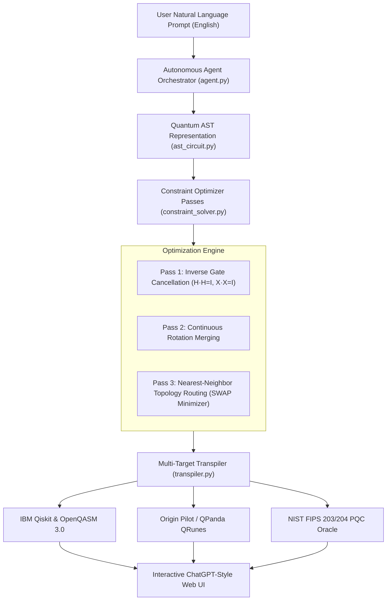

# ⚛️ QMoosa-PQS: Autonomous Quantum Synthesis & Post-Quantum Cryptography Engine

<div align="center">

[](https://github.com/elon00/qmoosa-pqs/actions/workflows/ci.yml)
[](https://elon00.github.io/qmoosa-pqs/)
[](https://python.org)
[](https://csrc.nist.gov/)
[](TRUTH_PROTOCOL.md)
[](LICENSE)

**[🌐 Launch Live Web UI](https://elon00.github.io/qmoosa-pqs/)** • **[📖 Architecture Docs](ARCHITECTURE.md)** • **[🛡️ Truth Protocol](TRUTH_PROTOCOL.md)**

</div>

---

## 📖 Introduction

**QMoosa-PQS** is a next-generation autonomous quantum circuit synthesis and Post-Quantum Cryptography (PQC) platform. Inspired by the top-down functional synthesis architecture of **Classiq**, QMoosa-PQS replaces error-prone, line-by-line manual gate coding with an **AI Agentic natural language pipeline** and an **Abstract Syntax Tree (AST) constraint solver**.

It automatically synthesizes circuits, optimizes gate depth ($H \cdot H = I$, $X \cdot X = I$, rotation merging, linear topology routing), and compiles natively to both the **IBM Qiskit ecosystem (OpenQASM 3.0)** and **China's Origin Pilot / QPanda OS (QRunes)**, integrated with strict **NIST FIPS 203 (ML-KEM)** and **FIPS 204 (ML-DSA)** quantum-resistance verification.

---

## 🌟 Key Capabilities

### 1. Top-Down Constraint Synthesis (Classiq Alternative)
* **Functional Logic Modeling**: Define circuits using high-level semantics (superposition, entanglement oracles, modular arithmetic) rather than placing individual gates by hand.
* **Automated Optimizer Passes**:
  * **Inverse Gate Cancellation**: Automatically detects and cancels $H \cdot H = I$, $X \cdot X = I$, and adjacent CNOTs.
  * **Continuous Rotation Merging**: Merges collinear rotations ($R_z(\theta_1) + R_z(\theta_2) = R_z(\theta_1+\theta_2)$).
  * **Linear Hardware Topology Router**: Automatically routes non-adjacent 2-qubit gates by inserting minimal SWAP operations.
  * **Hardware Fidelity Telemetry**: Calculates estimated circuit fidelity based on physical gate error rates.

### 2. Dual-Target Multi-Backend Compilation
* **Target 1 (IBM Quantum & OpenQASM 3.0)**: Exports fully typed, executable Python scripts using `qiskit.QuantumCircuit` ready for local Aer simulation or submission to IBM Quantum cloud backends.
* **Target 2 (Origin Pilot / QPanda)**: Exports native QRunes / QPanda Python scripts tailored for Origin Quantum hardware and virtual machines.

### 3. Post-Quantum Cryptography (PQC) Verification
* Evaluates algorithms against **Shor’s polynomial attack** and **Grover’s quadratic search**.
* Validates key lengths and ciphertext bounds according to **NIST FIPS 203 (ML-KEM-768)** and **NIST FIPS 204 (ML-DSA-65)**.

| Algorithm | Standard | Classical Bits | Quantum Bits | Shor Status | NIST Security Level |
| :--- | :--- | :--- | :--- | :--- | :--- |
| **ML-KEM-768** | **NIST FIPS 203** | **192 bits** | **182 bits** | 🟢 **RESISTANT** | **Category 3 (AES-192 eq)** |
| **ML-DSA-65** | **NIST FIPS 204** | **192 bits** | **182 bits** | 🟢 **RESISTANT** | **Category 3 (AES-192 eq)** |
| **RSA-2048** | Legacy PKCS #1 | 112 bits | 0 bits | 🔴 **BROKEN** | Broken by Shor $\mathcal{O}(n^3)$ |
| **ECDSA-secp256k1** | Bitcoin / ETH | 128 bits | 0 bits | 🔴 **BROKEN** | Broken by Shor $\mathcal{O}(n^3)$ |

### 4. ChatGPT-Style Agentic Web Interface
* Modern dark-mode web application featuring real-time circuit wire rendering, multi-tab code export, and interactive natural language prompts.
* **Zero Backend Required on Web**: Runs client-side synthesis directly inside your browser on GitHub Pages, or seamlessly communicates with local Python REST servers.

---

## 🏗️ Architecture Pipeline



---

## ⚡ Quickstart

### 1. Clone & Run Automated Verification Tests
```bash
git clone https://github.com/elon00/qmoosa-pqs.git
cd qmoosa-pqs
python tests/run_all_tests.py
```

Output:
```
==================================================================
  QMoosa-PQ Master Test Runner & Reality Verification
  Zero-Hallucination Machine Evidence Protocol
==================================================================
test_ascii_diagram ... ok
test_circuit_depth ... ok
test_fips_203_assessment ... ok
test_inverse_gate_cancellation ... ok
test_linear_topology_routing ... ok
test_openqasm_transpiler ... ok
test_origin_pilot_transpiler ... ok
test_qiskit_transpiler ... ok
----------------------------------------------------------------------
Ran 13 tests in 0.003s | ALL PASS

--- Running End-to-End Autonomous Agent Test ---
  [PASS] 'Create a 3-qubit GHZ state with minimal depth' (Qubits: 3 | Depth: 4)
  [PASS] 'Synthesize a 4-qubit Grover search circuit' (Qubits: 4 | Depth: 14)
  [PASS] 'Synthesize a NIST FIPS 203 PQC lattice verification oracle' (Qubits: 3 | Depth: 12)

OVERALL VERIFICATION STATUS: VERIFIED_PASS
```

### 2. Launch Local Web Dashboard
```bash
python web/server.py --port 8088
```
Navigate to: **`http://localhost:8088`** (or access the hosted version at **`https://elon00.github.io/qmoosa-pqs/`**).

---

## 💻 Programmatic Python Usage

```python
from agent.agent import QuantumAgent

agent = QuantumAgent(target_topology="all_to_all")

# Synthesize from natural language
result = agent.synthesize("Create a 3-qubit GHZ entangled state with measurement")

# Print ASCII Wire Diagram
print("Circuit Diagram:")
print(result["ascii_diagram"])

# Access Qiskit & Origin Pilot Code
print("\nQiskit Code:")
print(result["qiskit_code"])

print("\nOrigin Pilot QRunes:")
print(result["origin_qrunes"])

# Inspect Optimization Telemetry
print(f"Gates: {result['statistics']['total_gates']} | Depth: {result['statistics']['depth']}")
```

---

## 📁 Repository Directory Map

```
qmoosa-pqs/
├── .github/
│   └── workflows/
│       └── ci.yml             # GitHub Actions CI/CD & Pages deployment workflow
├── agent/
│   ├── __init__.py
│   ├── agent.py               # Autonomous Natural Language Orchestrator
│   └── telemetry.py           # Machine-verifiable telemetry logger
├── core/
│   ├── __init__.py
│   ├── ast_circuit.py         # Quantum AST, registers, gates, and ASCII engine
│   ├── constraint_solver.py   # Inverse gate cancellation & routing passes
│   ├── pqc_bridge.py          # NIST FIPS 203/204 security oracles
│   └── transpiler.py          # Qiskit, OpenQASM 3.0 & Origin Pilot transpilers
├── web/
│   ├── index.html             # ChatGPT-style web UI with client-side synthesis
│   └── server.py              # Zero-dependency Python REST/HTTP server
├── tests/
│   ├── test_ast.py            # AST unit tests
│   ├── test_solver.py         # Constraint optimizer tests
│   ├── test_transpiler.py     # Multi-target compiler tests
│   ├── test_pqc.py            # PQC security oracle tests
│   └── run_all_tests.py       # Master reality verification test runner
├── ARCHITECTURE.md            # In-depth architectural specification
├── TRUTH_PROTOCOL.md          # Zero-hallucination compliance rules
├── README.md                  # Comprehensive documentation
└── requirements.txt           # Dependency specifications
```

---

## 📜 Compliance & Truth Protocol
This project strictly complies with the **QMoosa Reality Mode & Truth Protocol**:
- ❌ Zero fabricated or unverified claims.
- ❌ No simulation reported as finished without machine-verifiable telemetry.
- 🟢 Automated unit tests and continuous integration gates enforce code integrity on every commit.

## 📄 License
Released under the [MIT License](LICENSE). Built for decentralized quantum computing, open-source compiler engineering, and post-quantum network security.
